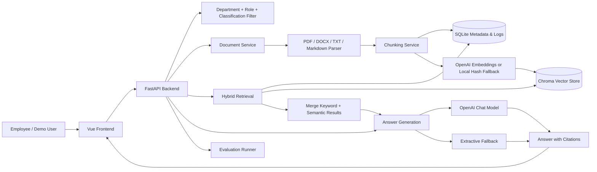
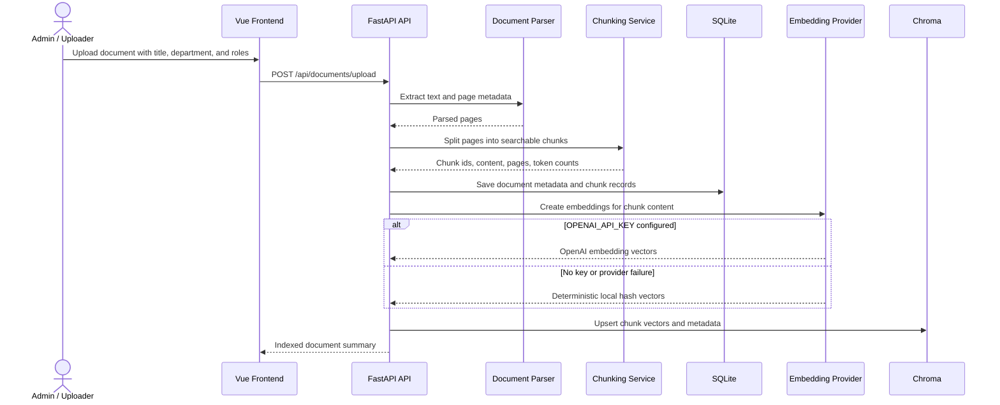
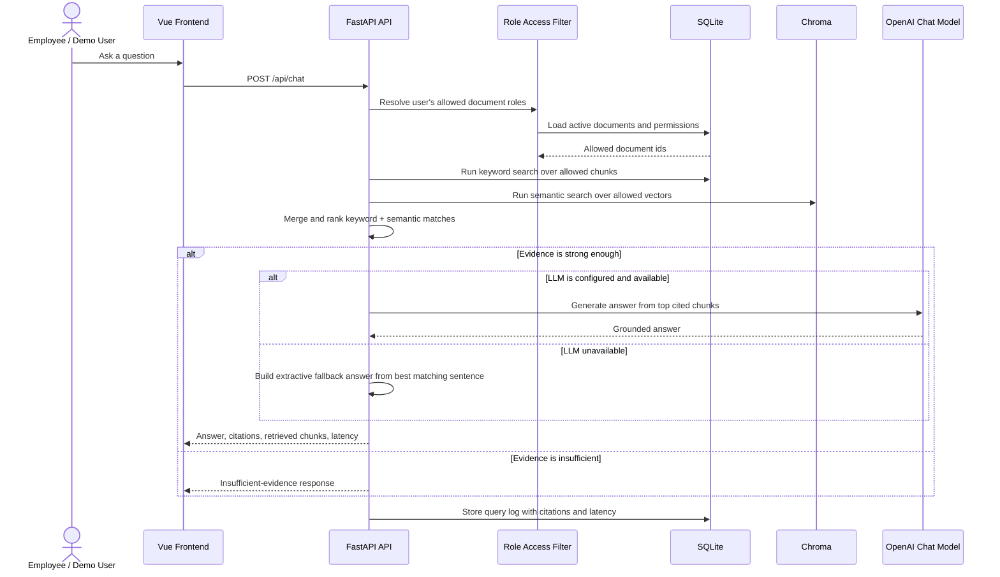

# Enterprise RAG Knowledge Assistant

Enterprise RAG Knowledge Assistant is a personal demo for an internal company knowledge assistant. Employees can ask questions about policies, operating manuals, and project documents, then inspect the source excerpts used to produce each answer.

The demo is intentionally local-first. It uses FastAPI, SQLite, Chroma, LangChain-compatible retrieval components, a LangGraph query workflow when available, and a Vue frontend.

## Capabilities

- Upload, parse, update, and list PDF, DOCX, TXT, and Markdown documents.
- Preserve document metadata, role access, document version, chunk id, and page number where available.
- Run hybrid retrieval with keyword scoring and Chroma-backed semantic search.
- Enforce enterprise-style access control with department, role, and document classification before retrieval.
- Return English answers with citations that include source document, page, version, chunk id, and excerpt.
- Return a clear English insufficient-evidence answer when available documents do not support the question.
- Store query logs with retrieved chunks, citations, status, and latency.
- Run seeded retrieval evaluation cases with hit rate, MRR, and citation coverage.
- Start locally with Docker Compose.

## Architecture



## Document Indexing Flow



## Question Answering Flow



## Demo Users

| User ID | Department | Roles |
| --- | --- | --- |
| `hr_user` | Human Resources | `employee`, `hr` |
| `it_user` | IT | `employee`, `it` |
| `pm_user` | Product | `employee`, `project` |
| `admin` | Operations | `employee`, `admin` |

## Access Control Model

Documents are filtered before keyword search, vector search, answer generation, and citation rendering. The demo uses three classification levels:

| Classification | Access Rule |
| --- | --- |
| `public` | Visible to all demo users |
| `internal` | Visible to users with `employee` or `admin` roles |
| `confidential` | Visible to `admin`, users in the same department, or users with a matching document role |

## Quick Start

Create an environment file:

```bash
cp .env.example .env
```

Start the application:

```bash
docker compose up --build
```

Open the frontend:

```text
http://localhost:5173
```

The backend API is available at:

```text
http://localhost:8000
```

## Local Backend Development

```bash
python -m venv .venv
source .venv/bin/activate
pip install -r backend/requirements.txt
uvicorn app.main:app --app-dir backend --reload
```

Run tests:

```bash
pytest backend/tests
```

Run the seeded retrieval evaluation:

```bash
PYTHONPATH=backend python backend/scripts_run_evaluation.py
```

## Local Frontend Development

```bash
cd frontend
npm install
npm run dev
```

## API Overview

| Method | Path | Purpose |
| --- | --- | --- |
| `GET` | `/api/users/demo` | List demo users |
| `GET` | `/api/documents` | List active documents |
| `POST` | `/api/documents/upload` | Upload and index a document |
| `PATCH` | `/api/documents/{document_id}` | Update document metadata and reindex a new version |
| `DELETE` | `/api/documents/{document_id}` | Deactivate a document |
| `POST` | `/api/chat` | Ask a question as a demo user |
| `GET` | `/api/chat/logs` | List recent query logs |
| `GET` | `/api/evaluations` | List evaluation records |
| `POST` | `/api/evaluations/run` | Run seeded retrieval evaluation cases |

## Example Questions

- How many days in advance should employees request planned vacation?
- When should a severity one incident be escalated?
- What is the next milestone for Project Orion?
- What is the cafeteria menu for next Friday?

The final question should return the insufficient-evidence response unless supporting content has been uploaded.

## Configuration

The demo runs without an API key by using deterministic local hash embeddings for retrieval and extractive answers. This fallback is useful for local demos, but it should be described as a fallback in portfolio or Upwork materials.

To use OpenAI for both chat answers and semantic embeddings, configure:

```text
OPENAI_API_KEY=
OPENAI_BASE_URL=
CHAT_MODEL=
EMBEDDING_MODEL=
```

`OPENAI_BASE_URL` can be left empty for the default provider endpoint.
When `OPENAI_API_KEY` is set, document indexing and semantic search use `EMBEDDING_MODEL` through the OpenAI embeddings API. If the embeddings call fails, the app logs a warning and falls back to deterministic local hash embeddings so the demo remains usable. After changing embedding providers or models, re-upload documents or reseed the sample data so the Chroma index is rebuilt with the new vector dimensions.

## Notes

This is a personal demo, not a production security system. Authentication is simulated through selectable demo users, and page extraction depends on the source file format and parser support.
